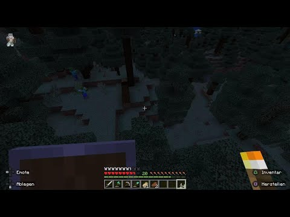

# L2Skill-hnr-

Opdracht 1:
Bedenk zelf ook nog een factor die van invloed kan zijn op de playability of replayability van een game. Waarom vind jij deze factor zo belangrijk?

Zet dit in een readme.

Een factor wat ik ook belangrijk vind is dat het er netjes en overzichtelijk eruit ziet. 
Bijvoorbeeld bij Minecraft heb je de healthbar, foodbar, armorbar, experiencebar en de inventory zitten in het midden over aan het scherm. 
Dit ziet er overzichtelijk uit. 
Als de health bij voorbeeld rechtsboven staat, foodbar links midden. 
Enzovoort. 
Dat ziet er minder overzichtelijk waardoor je aandacht naartoe gaat dan naar 1 punt waar alles staat. 
Ik zou zelf afdwarrelen als er over wat staat. 

Opdracht 2
Zoek online naar een video of artikel dat gaat over playability of replayability? Wat is volgens dit artikel de balangrijkste factor. Leg uit waarom dit volgens het artikel zo is. Ben je het er mee eens? geef je mening hierover.

Embed de video of een link naar het artikel in je readme. Embedcode voor video of image in een readme: Link naar webpagina: [tekst van de link](URL van de link)

Zet je uitwerking van de opdracht ook in dezelfde readme.

theoretically fun in games, comes from being able to learn, improve and achieve without the real life consequences. 
Patterns that match their personal interest at a good pace without providing ways to cheat.

Deze video heeft het vooral over patterns, dingen die terug komen. 
Daar ben ik het wel mee eens. Door patronen te zien, zou je eerder snappen wat er van je verwacht wordt in de game. 
Het wordt dan duidelijker en voorspelbaar. Vooral voor nieuwe spelers is dit een grote factor. 
Natuurlijk is de andere zien die ik hierboven in het engels heb geschreven (Komt uit de video) over dat het ook belangrijk is dat je soms niet de consequenties tegen kom. 
In een game zoals GTA kan je mensen aanrijden en wapens kopen/gebruiken. 
Door dit in de game te doen zou je wellicht niet zo snel dit in het echte leven doen, dat zou zorgen voor onverwachte situaties of iets wat je niet wil. 
Plezier is het belangrijkste in het spel anders zou je een spel niet snel spellen.

https://www.youtube.com/watch?v=lkatr_a1OMQ

Opdracht 3:
Zoek en edit een video clip (10 sec) van een voorbeeld van een bestaande game waarin goede "playability" duidelijk naar voren komt.

Zet de video in je readme.

Omschrijf in de readme wat er in de clip gebeurt en hoe dit de playability versterkt.

https://www.youtube.com/shorts/ivr1ehE59GM

De game dit in de short terug komt is Lethal Company een spel dat gemaakt is in Unity. 
Nu komt playability naar voren doordat de andere karakter het heeft over te zwaar zijn.
Hij was zwaarder dan 50 waardoor hij dood in de afgrond viel.

De playability is de balans van hoeveel gewicht je kan hebben om de sprong te maken. 
Het maakt de moeilijkheidsgraad wat moeilijker waardoor je goed moet opletten of je wel een jump haal of niet.

Opdracht 4:
Zoek en edit een video clip (10 sec) van een voorbeeld van een bestaande game waarin goede "re-playability" duidelijk naar voren komt.

Zet de video in je readme.

Omschrijf in de readme wat er in de clip gebeurt en hoe dit de re-playability versterkt.
 
https://www.youtube.com/shorts/MDwYcHHRWW8

De game die hier terug komt is de game genaamd buckshot roulette.
De re-playability komt hier terug omdat het telkens anders loopt en je niet weet of jij geschoten wordt of niet.
Ook kan je een naam kiezen zoals er is de short laten zien word. 
En kan je kiezen of je het geld wil verdubbelen of niet.

Je hebt dan verschillende uitkomsten en het is aanpasbaarheid. Zoals de naam en kiezen voor verdubbeling of niet.

Opdracht 5:
Kies 2 factoren voor playability of re-playablity uit die je zou willen doorvoeren in je towerdefense game. Omschrijf hoe je deze in je game wil gaan verwerken. Maak hierbij 2 kleine schetsjes die verduidelijken hoe deze factoren in je game zouden moeten worden geintegreerd.

Zet je schetsen en de uitleg in de readme.

Voor mijn towerdefense zou ik het liefste me game een balans geven met een moeilijkheidsgraad en aanpasbaarheid.
Voor de idee dat ik heb hebben ze beiden te maken met verschillende towers, meer enemy's.

Dit waren de ideeen voor mijn verschillende towers: In de game komen 5 verschillende towers voor. 
(1)Een husky tower die je damage geeft doordat hij in jouw radius praat, 
(2)Een Rottweiler die kwijlt als hij je ziet (er komt dan een plasje water op het pad) waardoor je langzamer gaat lopen. 
(3)Een tower die honden schiet die actief zijn en moeten lopen, doordat ze tegen je aan gaan krijg je damage. 
(4)Een hond die passie heeft voor aandacht en houd van likken, er komt dan een tong vanuit de tower die in een bepaalde radius 1 persoon per keer kan likken en damage krijgt. 
(5)Een tower met een hond erop die poept na een aantal seconden op het pad die mensen belopen.

De verschillende enemies zou dan bijvoorbeeld een postman kunnen zijn die kranten gooit waardoor hij niet geraakt wordt door de towers als een soort defense. 